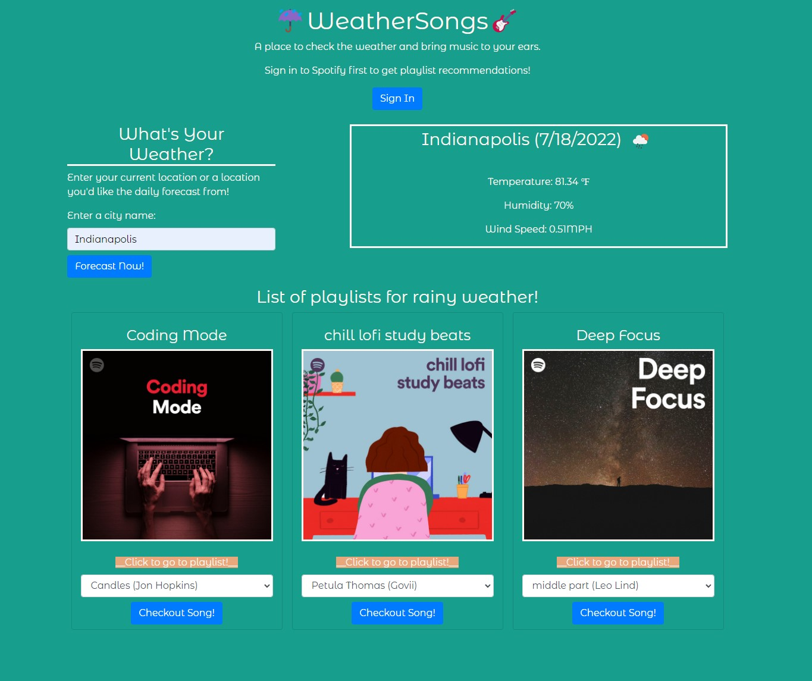
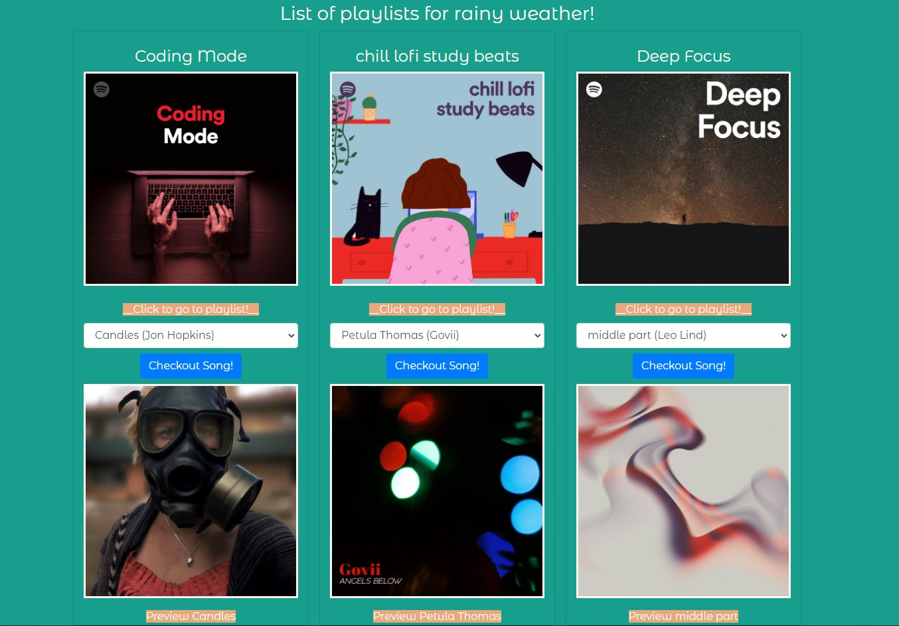
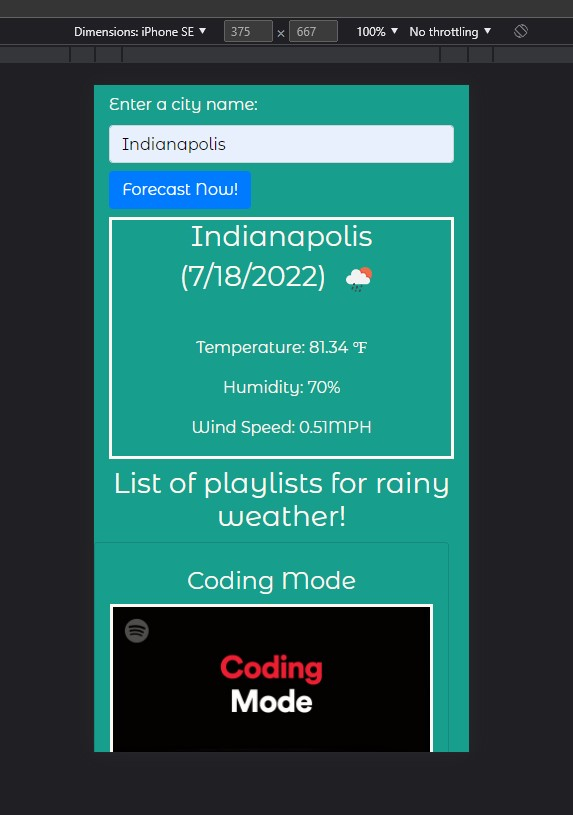
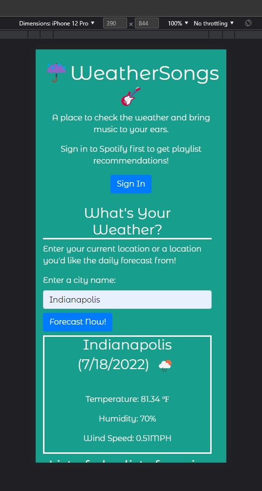

# WeatherSongs

//insert link here

### Summary
* Weather dashboard that shows Spotify playlists based on weather
* Shows temperature, humidity, wind speed
* Shows playlists, tracks and link to playlist

### The project layout
* The user can input their city and search for the weather
* The user is then given three playlists
* Picks random genre based on weather and displays three playlists
* Can choose a song and get track preview

* Song track preview

* Iphone SE view for mobile use

* Iphone 12 Pro view for mobile use

### Features
* HTML
* CSS
* JS
* Bootstrap
* JQuery
* API
